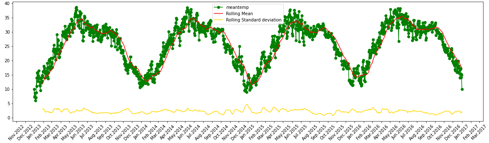
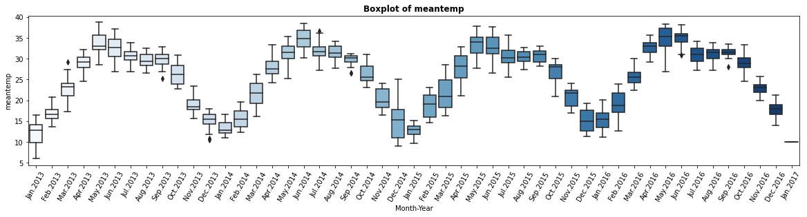
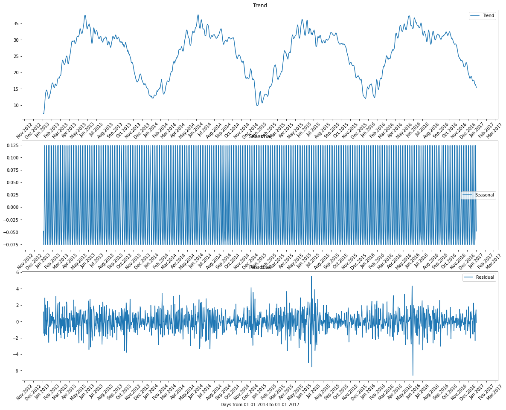
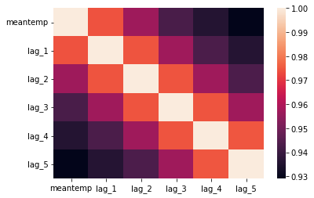
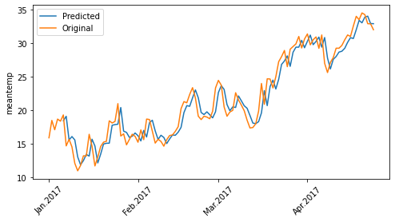
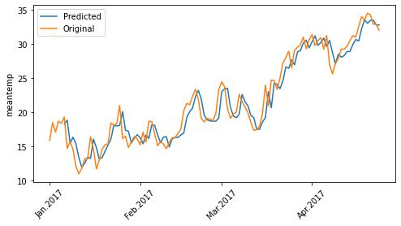
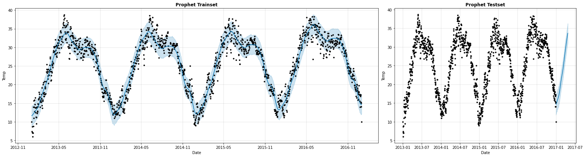
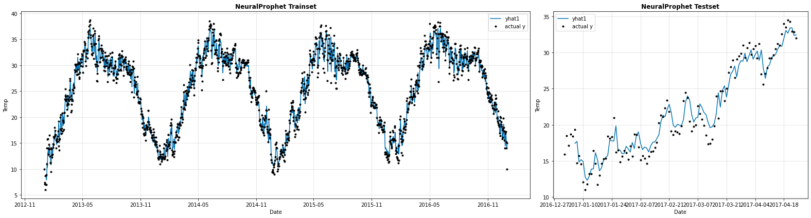
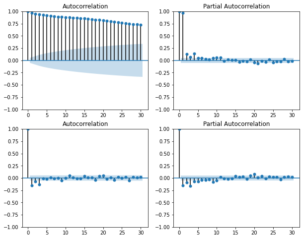

# ML-Models-for-Time-Series-Forecasting

Time series data is a sequence of data points indexed in time order and methods for predicting them are different than normal data. In this project, I try different feature engineering methods and different models to see their performances in forecasting the mean temperature of Dehli [kaggle](https://www.kaggle.com/datasets/sumanthvrao/daily-climate-time-series-data). For more description, figures, and other parts like Exploratory data analysis see the script. For more information regarding the models, you can read this [blog](https://neptune.ai/blog/select-model-for-time-series-prediction-task).

Plotting the meantemp:







### Models:
1. Linear Regression
2. Random Forest
3. XGBoost
4. Prophet and NeuralProphet
5. SARIMA

### Dataset:
The dataset contains meantemp, humidity, wind_speed, meanpressure, and the dates. I use and predict the meantemp feature. For the first 3 models, I create 3 different dataframes with different features based on [medium](https://medium.com/data-science-at-microsoft/introduction-to-feature-engineering-for-time-series-forecasting-620aa55fcab0)

The first method is to simply use different date attributes:
```python
    Trainset['month'] = pd.to_datetime(Train.index).month
    Trainset['Week_n'] = pd.to_datetime(Train.index).isocalendar().week
    Trainset['Day'] = pd.to_datetime(Train.index).day
    Testset['month'] = pd.to_datetime(Test.index).month
    Testset['Week_n'] = pd.to_datetime(Test.index).isocalendar().week
    Testset['Day'] = pd.to_datetime(Test.index).day
```

The second method is to use lags. Lag features are values at prior timesteps that are considered useful because they are created on the assumption that what happened in the past can influence or contain a sort of intrinsic information about the future.
```python
      # Add lags (The past values are known as lags) to the dataset. PACF plays an important role to get the right number of the lags
      for inc in range(1,6):
          field_name = 'lag_' + str(inc)
          Trainset[field_name] = Trainset['meantemp'].shift(inc)
          Testset[field_name] = Testset['meantemp'].shift(inc)
```

The third method is to use a rolling window. The main goal of building and using rolling window statistics in a time series dataset is to compute statistics on the values from a given data sample by defining a range that includes the sample itself as well as some specified number of samples before and after the sample used.
```python
      rolling_mean = Trainset.rolling(window=5).mean()
      rolling_max = Trainset.rolling(window=5).max()
      rolling_min = Trainset.rolling(window=5).min()
      Trainset['rolling_mean'], Trainset['rolling_max'], Trainset['rolling_min'] = rolling_mean, rolling_max, rolling_min
      rolling_mean = Testset.rolling(window=5).mean()
      rolling_max = Testset.rolling(window=5).max()
      rolling_min = Testset.rolling(window=5).min()
      Testset['rolling_mean'], Testset['rolling_max'], Testset['rolling_min'] = rolling_mean, rolling_max, rolling_min
```

E.g. using dataset created by the lags and scaled between -1 and 1, 3 models of linearRegression, RandomForrest, and XGBoost are trained and used to predict. 
|meantemp|	lag_1|	lag_2|	lag_3|	lag_4|	lag_5|
|:-------------:|:-------------:|:-------------:|:-------------:|:-------------:|:-------------:|
|	7.000000|	6.000000|	8.666667|	7.166667|	7.400000|	10.000000|
|	7.000000|	7.000000|	6.000000|	8.666667|	7.166667|	7.400000|
|	8.857143|	7.000000|	7.000000|	6.000000|	8.666667|	7.166667|
|	14.000000|	8.857143|	7.000000|	7.000000|	6.000000|	8.666667|
|   11.000000|	14.000000|	8.857143|	7.000000|	7.000000|	6.000000|



```python
from sklearn.linear_model import LinearRegression
from sklearn.ensemble import RandomForestRegressor
from sklearn.preprocessing import MinMaxScaler
import xgboost as xgb
```

**LinearRegression()**



**RandomForestRegressor(max_depth=5)**


**xgb.XGBRegressor(objective='reg:squarederror', learning_rate=0.05, max_depth=3)**



### Result:

|Model	|MAE_Train	|RMSE_Train	|MAE_Test	|RMSE_Test|
|:-------------:|:-------------:|:-------------:|:-------------:|:-------------:|
|Linear Regression |0.076048	|0.100125	|0.084995	|0.107578|
|Random Forrest max_depth=5 |0.069703	|0.090522	|0.084989	|0.108715|
|XGBoost lr=0.05 & max_depth=3 |	0.069496|	0.090210|	0.085071|	0.108815|


For Prophet and NeuralProphet models, the dataframe must consist of two columns of y (target feature which is meantemp) and ds (date).
```python
from prophet import Prophet
from neuralprophet import NeuralProphet
```
```python
  df = Train[["meantemp"]] 
  df.rename(columns={"meantemp": "y"}, inplace=True)
  df['ds'] = pd.to_datetime(Train.index)
```  
**Prophet(weekly_seasonality=False, daily_seasonality=False)**



Prophet: MAE_Train: 1.58942956629 - RMSE_Train 2.019178940866984 - MAE_Test 2.229713724510572 - RMSE_Test 2.7251281785326342

**NeuralProphet(n_lags=lags, learning_rate=0.01, num_hidden_layers=1, seasonality_reg=0.2, weekly_seasonality=False, daily_seasonality=False)**



NeuralProphet: MAE_Train: 1.1258757235502816 - RMSE_Train 1.502469718180313 - MAE_Test 1.4588360756955796 - RMSE_Test 1.8114394949674366


The Autoregressive Integrated Moving Average (ARMA(p, d, q)), model combines Autoregression (AR(p)) and Moving average (MA(q)) models with automatic differencing (d). Since meantemp is not stationary and by using one order of differencing, it becomes stationary, we can set d=1. Seasonality is important for forecasting if our data has one. Thus, seasonal autoregressive integrated moving-average (SARIMA(p, d, q)(P, D, Q)m) adds seasonal effects into the ARIMA model.  (P, D, Q) represent the seasonal orders and m is simply the number of observations per year. In this case, we have daily data, m=365. The ACF and PACF plots will help to have an estimate of these values. A helpful link for this purpose is https://arauto.readthedocs.io/en/latest/how_to_choose_terms.html. 
```python
from statsmodels.tsa.statespace.sarimax import SARIMAX
```
```python
  df = Train['meantemp']
  df.index = pd.DatetimeIndex(Train.index).to_period('D')
```
**model = SARIMAX(Train['meantemp'], order=(1, 1, 3), seasonal_order=(1, 1, 1, 365)).fit()**



A drawback of using SARIMA here is as m=365, the runtime becomes very long!!

